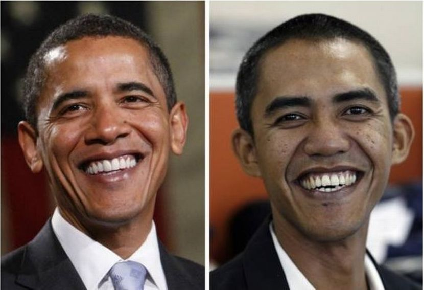
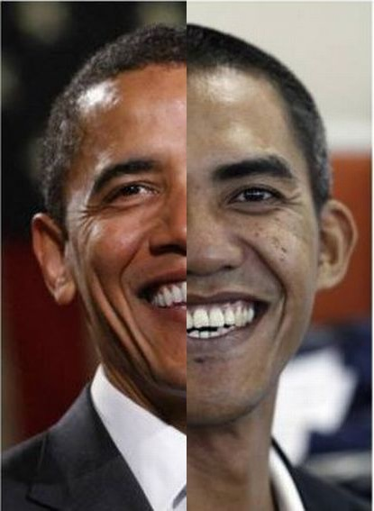
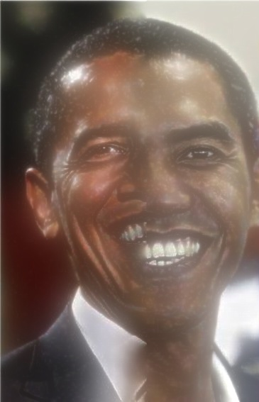
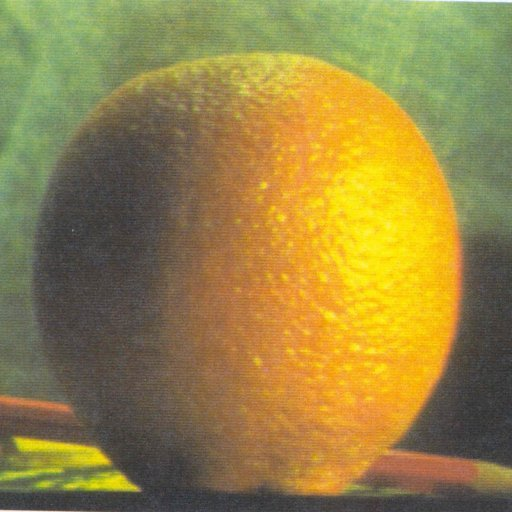
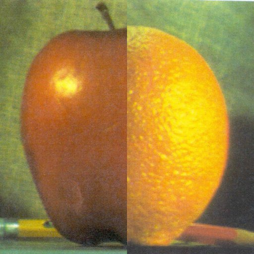
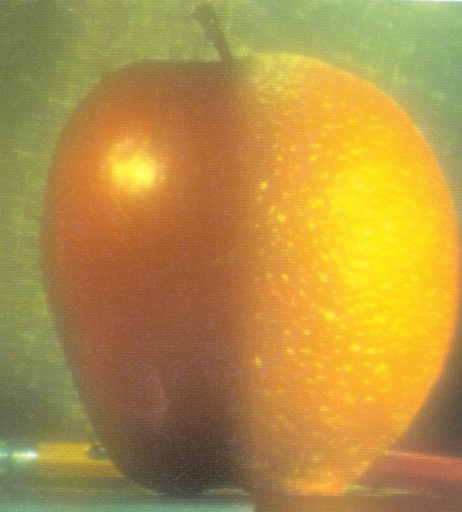

# image_blending
A simple image blender using laplacian pyramids

### Note
This is an intensity blender and not a feature blender. For theory, check the reference links at the bottom.

## Examples

Original-Image:

Simple Blend:

Complex Blend:

Original-Images:

Simple Blend, Orapple :

Complex Blend, Complex Orapple:

### REFERENCES
[ Image pyramid Opencv docs]( http://docs.opencv.org/master/dc/dff/tutorial_py_pyramids.html#gsc.tab=0 )

[ Laplacian pyramid theory ] ( http://graphics.cs.cmu.edu/courses/15-463/2005_fall/www/Lectures/Pyramids.pdf )

[ Intutive explaination of laplacian pyramids ] ( https://rorasa.wordpress.com/2011/02/26/image-pyramid/ )

[Blog on blending using masks] ( https://compvisionlab.wordpress.com/2013/05/13/image-blending-using-pyramid/ )
